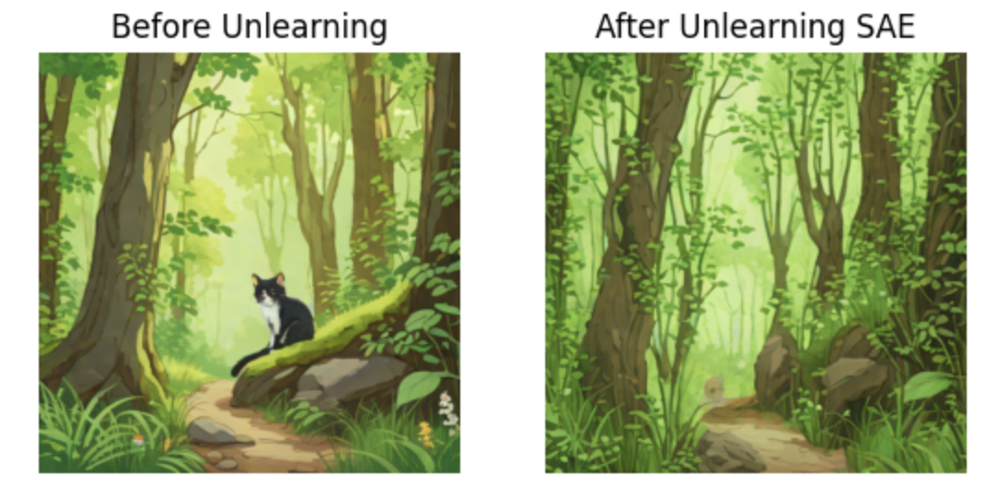

# Unlearning Concepts in Diffusion Models with SAeUron

> **Selective concept removal in diffusion models using Sparse Autoencoders (SAEs)**  
> Implemented on **SDXL-Turbo** with **NNsight-based activation steering**

---

## Overview

Diffusion models have achieved remarkable success in high-quality image generation.  
However, they may unintentionally generate **undesirable or restricted concepts**, such as:

- Explicit or harmful content  
- Copyrighted imagery  
- Biased or sensitive visual concepts  

**Concept unlearning** aims to selectively remove a model’s ability to generate specific concepts **without retraining the entire network**.

In this project, we implement **SAeUron**, a concept unlearning method that operates by:

- Identifying **concept-specific internal features** using **Sparse Autoencoders (SAEs)**
- **Ablating those features during inference**
- Preserving the rest of the model’s generative capabilities

---

## Core Question

> **Can we make a diffusion model “forget” a specific concept while preserving overall image quality and generalization?**

This repository explores that question empirically.

---

## Key Contributions

- **SAE-based interpretability**: Explicitly identifies which internal features correspond to a concept  
- **Inference-time unlearning**: No model retraining required  
- **Minimal side effects**: Other concepts remain largely unaffected  
- **Quantitative evaluation** of:
  - Unlearning accuracy
  - Quality preservation  
- Interactive control via **negative multiplier slider**

---

## Method Overview

### 1. Model Setup
- **Base model**: `stabilityai/sdxl-turbo`
- **Instrumentation**: `NNsight`
- **Target layer**: `unet.up_blocks.0.attentions.1`
- **SAE**: Pretrained Sparse Autoencoder on SDXL-Turbo activations

---

### 2. Sparse Autoencoder (SAE)

A Sparse Autoencoder learns to reconstruct diffusion model activations such that:

- Only a **small number of latent features activate**
- Each feature often aligns with **semantic concepts**

This allows us to **identify and manipulate concept-specific features** inside the model.

---

### 3. Phase 1 — Identifying Concept-Specific Features

For a target concept **c**, we compare:

- Activations from prompts **with concept c** (`D_c`)
- Activations from prompts **without concept c** (`D_¬c`)

We compute a normalized **concept score** per SAE feature:

\[
\text{score}(i) =
\frac{\mu(i, D_c)}{\sum_j \mu(j, D_c)}
-
\frac{\mu(i, D_{\neg c})}{\sum_j \mu(j, D_{\neg c})}
\]

Where:
- \(\mu(i, D)\) = average activation of feature *i* over dataset *D*

**Interpretation**:  
> High score ⇒ feature is strongly associated with the target concept

---

### 4. Phase 2 — Feature Selection

We keep the **top τ₍c₎ features** while removing:
- **Dead features** (activated < 1%)
- **Overactive features** (activated > 99%)

This yields a compact feature set \(F_c\) to ablate.

---

### 5. Phase 3 — Inference-Time Feature Ablation

During each denoising step:

1. Encode activations using the SAE  
2. For features \(i \in F_c\):
   - If activation exceeds its mean:
     \[
     f_i(x) \leftarrow \gamma_c \cdot \mu(i, D_c) \cdot f_i(x)
     \]
   - Where \(\gamma_c < 0\) is a **negative multiplier**
3. Decode activations back into the diffusion model

This **suppresses concept-specific features** while preserving others.

## Example

---

## Experiments

### Concepts Tested
- **Cats**
- **Towers**

---

### Qualitative Results

| Prompt | Before Unlearning | After Unlearning |
|------|------------------|------------------|
| Cat prompt | Cat visible | Cat suppressed |
| Tower prompt | Tower visible | Tower suppressed |

---

### Quantitative Evaluation

#### 1. Unlearning Accuracy (UA)

Measured using a **ViT classifier** trained on 20 object classes.

> **UA = fraction of images where the target concept is *not* detected**

| Concept | UA |
|-------|----|
| Cats | 70–100% |
| Towers | 90–100% |

(Depends on multiplier strength)

---

#### 2. Multiplier Sweep

| Multiplier | Cats UA | Towers UA |
|-----------|---------|-----------|
| -0.001 | 60% | 80% |
| -0.1 | 70% | 90% |
| -3.0 | 90% | 100% |
| -5.0 | 100% | 100% |

---

#### 3. Quality Preservation

Measured via **CLIP similarity** between original and ablated images.

| Concept | Multiplier | CLIP Similarity |
|-------|-----------|----------------|
| Cats | -0.5 | 0.85 |
| Cats | -1.0 | 0.82 |
| Towers | -0.5 | 0.80 |
| Towers | -1.0 | 0.73 |

> **Trade-off observed**:  
> Stronger unlearning → lower image quality

---

## Interactive Control

Includes a **slider UI** to dynamically adjust the negative multiplier and observe:

- Degree of concept suppression
- Visual quality degradation in real time

---

## Reproducibility

Everything require to reproduce this project is within the Unlearning.ipynb.

